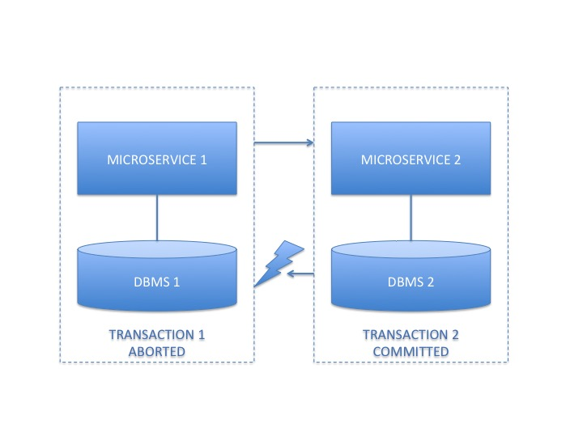

<strong>Atomikos TransactionsEssentials: light-weight distributed transactions
</strong>

<em>Community development "mirror" of <a href="https://www.atomikos.com/Main/TransactionsEssentials">atomikos.com/Main/TransactionsEssentials</a>.</em>

<em><strong>New contributors welcome - help us shape transactions for the cloud!</strong></em>

<em>Please <a href="https://github.com/atomikos/transactions-essentials/stargazers">star this project</a> to help us grow. Thanks in advance!</em>

## Highlights

* **Distributed transaction management for Java** - so your Java application gets **instant reliability** without design efforts in your code.
* **Microservices support** - so you can have one global transaction spanning several services.
* **JEE compatible** - so it integrates effortlessly in your **Spring** or **Tomcat** configuration.
* **Light-weight**  - so your **microservices** can use it, too.
* **Embeddable in your code** - so you can **test everything in the IDE** and avoid late integration issues at deployment time.
* **OSGi support** - so you can use OSGi containers also.
* **Connection pooling for JDBC and JMS** - so you get maximum **performance**.
* **Built-in support for Hibernate and JPA** - so you can use your favorite persistence framework.
* **Automatic crash / restart recovery** - so your incomplete **distributed transactions are cleaned up** and your data returns to a consistent state.
* **Cloud-native design** - so your applications are ready for **deployment to your cloud**. 
* **Commercial support available** - if you're serious about transactions in your business. 

## NEW: Microservice Support

With microservices, the typical monolith ACID transaction becomes split into 2 or more local transactions, one in each microservice. This can quickly lead to inconsistencies - for instance if there are network timeouts or other failures: 

Some concrete examples of possible inconsistencies:

 * For network timeouts, microservice 1 does not see the difference between a failure/rollback of microservice 2 and a commit at microservice 2. The global system state (and consistency) is undefined.
 * For retries (when microservice 1 calls microservice 2 a number of times until it does succeed) we depend on microservice 2 offering a correct implementation of an idempotent consumer. This is hard and error-prone.
 * Also for retries, microservice 1 has to remember that it needs to retry at microservice 2. This adds technical complexity to an otherwise simple scenario.
 * For failures when invoking microservice 2 there is no easy alternative but to retry (due to the above). This means you can't have microservice 1 forget about microservice 2 and try an equivalent "competing" implementation. Why? Because it just might be that the invocation of microservice 2 did actually commit.

We allow 1 global transaction, even across separate microservices and you don't have to code anything for that. In the example shown, a failed call means rollback at microservice 2, and if you want then you can safely try an alternative microservice instead (even within the same global transaction). 

Working samples are included in our <a href="https://www.atomikos.com/Main/TransactionsEssentials">official download</a>. This enables safer retries (if you do want to retry - that is your choice) plus the notion of a global commit.

For more information on how to fine-tune microservice transactions: check out our <a href="https://atomikos.teachable.com/p/microservice-transaction-patterns">online course</a>.

## Using TransactionsEssentials

### Getting Started

See [Getting Started](http://www.atomikos.com/Documentation/GettingStarted) for general documentation.

### Documentation

See documentation at [www.atomikos.com/Documentation](http://www.atomikos.com/Documentation/)

### Code Samples

Register and download from [www.atomikos.com](http://www.atomikos.com/)

### Releases

Register and download from [www.atomikos.com](http://www.atomikos.com/)

Or check [Maven Central](http://search.maven.org) (no samples available there)

## Governance & Participating

### Joining

See our [Community Page](http://www.atomikos.com/Main/AtomikosCommunity) for how to join us.

### Building From Source

Pull latest from repo `git pull origin master` and try `mvn clean install -Popensource`.

### Contributing

The fastest way to contribute is by starring this project. Thank you :-)

See our [contributor guidelines](CONTRIBUTING.MD) for inspiration and guidance.

### Code of conduct

See our [code of conduct](CODE-OF-CONDUCT.MD) for details and how to report violations.

### About This Repository

This GitHub project is merged with  - and updated regularly from - our internal development repository to work towards our next open source release (note: stable maintenance releases and our commercial power features are managed outside GitHub). 

IMPORTANT: we (Atomikos) don't develop on GitHub ourselves (yet) so you won't see a lot of our commits here - only refreshes when we merge + push to GitHub. That is because at least initially, the sole purpose of this project is to allow interested GitHub community members to fork and contribute useful features to what we have.

Activities here are probably higher when:

   - we prepare a new community release (milestone), and 
   - the 3 months of stabilization period after that (during which we publish lots of bug fixes)
   - (check the milestones page with due dates to get an impression...)
   
After that, we are busy upgrading our customers and on-boarding new customers so you will see less activity here. That's because most customer work is done in our private repositories.

## Special Thanks / Featured Contributors

You know how it goes, one always forgets to mention someone - but the following fine people have all delivered memorable technical contributions to this project in one way or another.

So: **thank you!** (and apologies to the superstars not mentioned here):

 - [@pascalleclercq](https://github.com/pascalleclercq) 
 - [@tkrah](https://github.com/tkrah) 
 - [@dpocock](https://github.com/dpocock) 
 - [@lorban](https://github.com/lorban) 
 - [@dandiep](https://github.com/dandiep) 
 - [@gregw](https://github.com/gregw) 
 - [@janbartel](https://github.com/janbartel)
 - [@Fungrim](https://github.com/Fungrim)
 

## License

See our [license policy page](http://www.atomikos.com/Main/WhichLicenseApplies).

## Feedback Wanted!

Do you think something's missing on this page? Please open an issue to let us know!

_Copyright (c) 2000-2020, Atomikos - all rights reserved. Visit [www.atomikos.com](http://www.atomikos.com/) for more..._
